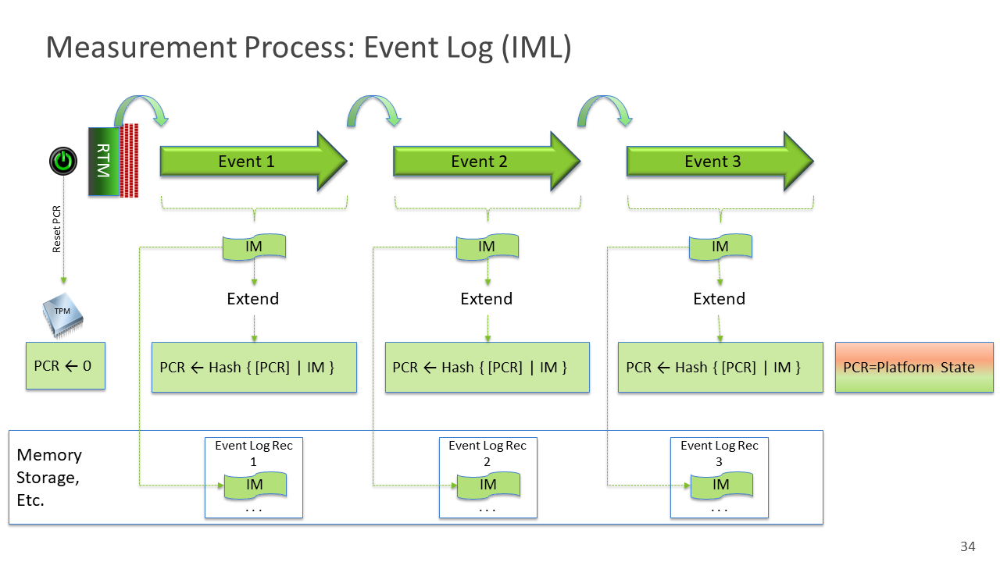
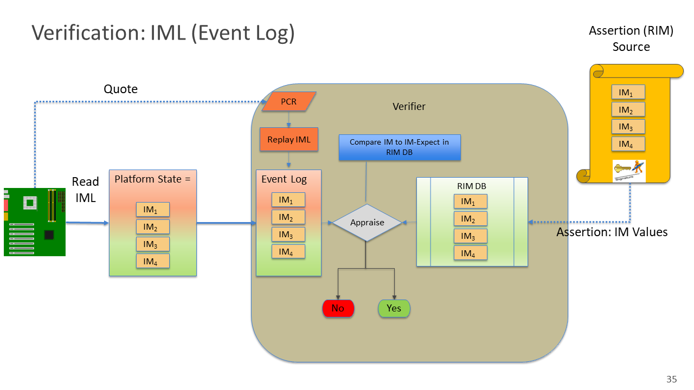
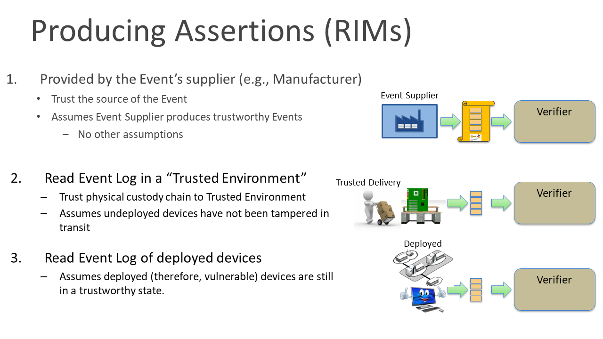
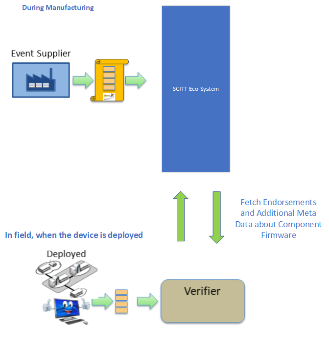
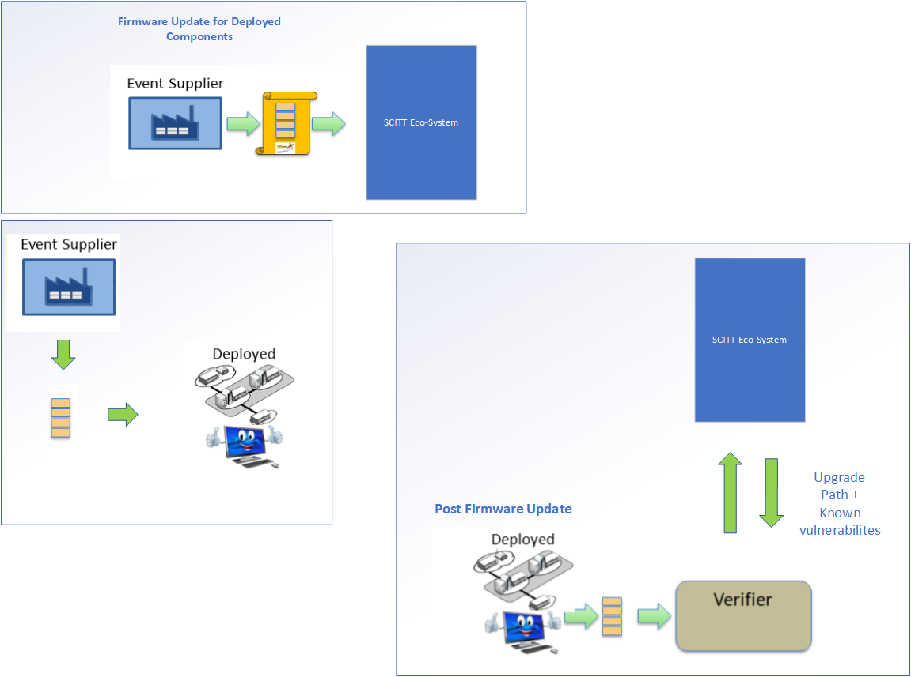

# Firmware Use Case

## Scope
This document aims to confirm that the SCITT building blocks and threat model satisfy the use case requirements. It is not
intended to be all-encompassing across all aspects of the hardware supply chain. Instead, it introduces the topic and highlights
unique properties that warrant investigation in the working group and may influence the final architecture document. Ultimately,
implementations will make final design decisions (e.g., storage/network architectures, standards/policies, artifacts, signatures,
endorsements, claims) based on their mission needs while meeting the interoperability objectives of SCITT.

This use case is scoped to device firmware. Device firmware loads and operates starting at the device's "reset vector", performs
dedicated functions such as device initialization, then loads the starts the Operating System (OS). These functions are dedicated 
to the operational characteristics of the device. They typically perform initialization functions such as memory configuration
that are needed prior to the OS and OS Present drivers. Firmware loads and executes outside the scope and visibility
of the Host Processor and the Operating System.

Firmware, while serving a specialized function is typically developed and operates as "traditional" software. It is developed and
provided by the Device manufacture. Distribution and installation is done using Device Manufacturer specialized operations --
typically call a Firmware Update.

This use case will focus on devices commonly called the "PC Architecture". These are based on the x86 CPU, UEFI Boot architecture,
and commonly available Operating Systems such as Windows or Linux. While the term PC implies "Personal Computer" this architecture
is common to several device classes such as networking equipment, servers, industrial controller (e.g., a PLC) etc.

### **Simple Device Firmware**:
This use case considers a simple device with only firmware for the device's host (aka Application processor). In this use case, this
firmware is called the "Host Firmware". The Host Firmware is responsible for boot strapping the device's host processor, memory, its
peripherals and other components needed by the Host Processor. The Host Firmware may also contain runtime components that execute
transparently the Host Processor. Examples of runtime executables are SMM drivers on X86 class devices and TrustZone on ARM class
processors. Example devices in this use case are Personal Computers, servers, network equipment, etc.

> This distinction is to enable a more detailed or complex Use Case were firmware within individual components of the Device is
considered. The more complex use cases will rely, no depend, on this one. 

## Terminology
## Use Case: Simple Device Firmware
### Description
As much of the device's hardware components (CPU, memory, IO Hubs, etc.) are now commodity and standard, most device manufacturers
start Host Firmware development using commonly available 3rd party libraries, typically from sources outside the manufacturer. These
are Independent BIOS Vendors (IBVs). The IBV packages also have common components which IBV's may obtain from their outside sources.
For example, firmware may contain cryptographic modules used to verify other components or updates. Another example may be a network
stack used to remotely boot the device such as PXE boot. Modules to perform these functions may be bundled into the IBV's larger
package when delivered to the device manufacture.

### Boot Sequence
The Host Firmware may be comprised of several discrete firmware modules loaded and executed during the various phases of the initial
boot cycle. Using a common X86 architecture as an example, the boot phases and firmware modules are:

|Ref|Boot Cycle|Firmware Module|Function|
|---|---|---|---|
|1|Initial Boot Vector|Boot Vector Code|Performs simple CPU configuration and load next Firmware modules|
|2|Memory Configuration|Memory Module|Configures memory. This may be supplied by the memory controller manufacturer|
|3|Load runtime|Runtime module|Load runtime code such as SMM and UEFI runtime executable|
|4|Full Boot Mode|PXE module|Main module that finds, loads, and executes other device-specific built-in or plug-in modules|
|5|Execution of Device-specific modules|built-in or plug-in device modules|Pre-boot configuration of a specific device|
|6|OS Boot|Boot Loader|Finds, loads and executes the OS|
|7|OS|Operating System|This is the user visible application processor Operating System|

### Contrast with OS Present Supply Chain Use Cases
OS and Application Supply Chain use cases provide for verification of software _before_ it is executed (or even loaded). As Host
Firmware loads and executes prior to the OS having the ability to verify it, these HFW (Host Firmware Components) cannot be
verified. HFW is transient and cannot be inspected after it executes. It is opaque to the OS after the OS boots. Even the runtime
HFW components (e.g., UEFI runtime protocols) are opaque to the OS as they are in protected memory preventing the OS from access it.

> Secure boot is often cited as solving this. In Secure Boot, the HFW component's are digitally signed by an authority (typically
> the device manufacturer). These signatures are verified during the device's boot sequence. This only provides proof of the origin
> of the HFW component, not which HFW. For example, if a HFW Component version 1 were signed by the device manufacturer but later
> found to have a vulnerability, the device manufacturer can release HFW Component version 1.1 to address it. As updating the
> verification keys in Host Firmware is difficult and risky, HFW Component version 1.1 will be signed by the same keys. The boot
> firmware will allow either version 1 or 1.1 to load and execute. This fails to support Supply Chain Assurance.

### Boot Measurements to support Supply Chain Assurance
A device equipped with a TPM and HFW supporting measurement using the TPM provides trustable artifacts of the Host Firmware that can
be assessed even after they have executed and removed from memory. This is done use Integrity Measurements as depicted in the
Figures below.

The TPM contains registers called Platform Configuration Registers which have the following properties:
* Each PCR is the size of a hash
* All PCRs are initialized to zero on device initialization
* Starting from the earlies boot component called the Root of Trust for Measurement (RTM) the current component _measures_ the next
    prior to executing it
	* A Measurement operation is:
	* Hash the next component
	* Perform the _Extend_ operation on the TPM
		* The TPM, internally, concatenates the current PCR contents with the _Extend_ value
		* The new value is hashed
		* The PCR content is replaced with a hash of the new value
> PCR <- Hash{ [PCR] | _Extend_ }

This builds a chain of Integrity Measurements representing the all the HFW components executed during the boot sequence.

The PCR is _Evidence_ in IETF RATS terminology. For the TPM, it is obtained using a _Quote_ operation which digitally signs the PCR
using a key trusted by the Verifier.

To provide higher resolution and visibility into the boot sequence, the HFW creates a sequence of each Integrity Measurements. This
allows a verifier to examine either the end state or the details of the boot sequence.

> The above is a summary of the [PC Client Platform Firmware
Profile](https://trustedcomputinggroup.org/resource/pc-client-specific-platform-firmware-profile-specification/)

### Reference Measurements
A verifier will need to know the _Expected_ values to make an assessment. These are called _Reference Integrity Measurements_ or in
IETF RATS terminology, _Endorsements_. These are typically provided by the device manufactures in the role of _Endorser_ and are
digitally signed. The Trusted Computing Group has defined a format for HFW called RIM (Reference Integrity Manifest)
> [PC Client Reference Integrity Manifest](https://trustedcomputinggroup.org/wp-content/uploads/TCG_PC_Client_RIM_r1p04_pub.pdf)

The Verifier collects the _Endorsements_ (RIMs) then requests the _Evidence_ (PCR via a Quote function). The Verifier compares the
_Endorsements_ against the _Evidence_ and makes an assessment.

This is shown in the following Figures.

## SCITT Use Case
Device Manufacturers often provide several versions of their Firmware to improved functionality, address flaw, or vulnerabilities.
Some versions may impact the Device's performance and trustworthiness in different ways in different applications. Using SCITT,
consumers can obtain 3rd party assessments of the potential impact of various firmware versions distributed.

SCITT may also provide a means for parties other than the Device Manufacturer to provide RIMs. The information to generate a RIM is
obtainable by a standard set of utilities. For example, a 3rd party can make system calls in both Windows and Linux operating
systems to read the PCRs and the Event Logs. This can be done using what the 3rd party considered a "trusted environment". A RIM can
be built and signed by that 3rd party. This may be an end user or the receiving IT department. This information can be put onto a
SCITT-based repository for others to compare and consume.

In this use case a Device Manufacturers introduces a Firmware Component release bundled as RIM payload into a SCITT registry. The benefit of such approach is that it adds transparency to Manufacturer releases. Various independent actors in the SCITT eco system can add further annotations to the published firmware.
When the device boots up and the PCR's are used to construct a quote which forms the Evidence, which is then sent to a Verifier, to establish the trustworthiness of the device, as part of the attestation flow. In this use case the Verifier fetches the Endorsements and associated metadata from the SCITT Transparent Registry and then appraise the received evidence to establish trustworthiness. The Verifier trust can be further augmented using the annotations it receives in the metadata for the release, it receives with the Endorsements.

When a device is deployed in the field and receives a Firmware Update. The process is similar.
The Manufacturer or any supply chain entity responsible for a Firmware Update(example firmware integrator) first publishes the update in a SCITT Manages transparent registry. 

When the device generates new PCR's and a subsequent Quote is sent to a Verifier, a new fetch of Endorsements from SCITT will be used to fetch the new Fw Release and its associated metadata.
If the device received Evidence is still on the old firmware release, then the SCITT Endorsements and 
its metadata can be used by a Verifier to indicate the upgrade path the device firmware may undertake.
