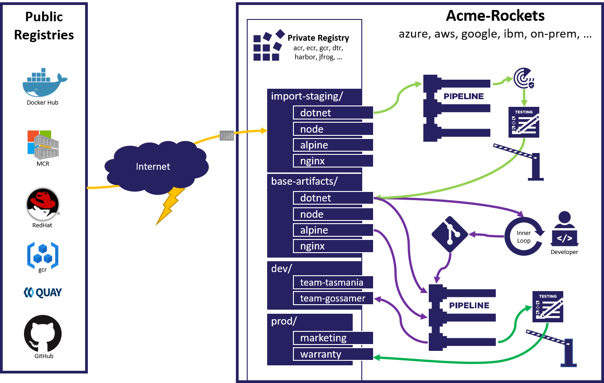

# Building and Consuming Dependencies

You're starting down the path of securing your supply chain. You want to verify the sources (packages & components) you build from and with (sdks and compilers).
Before focusing on "a secure supply chain", you might simply have performed `npm restore`, `apt get` or select references from public registries which are pulled into your project.
For container scenarios, you might pull the base image you'll deploy with, or the sdk images you'll compile with from [docker hub][docker-hub]. In all cases, the built applications and services have dependencies from external sources.

How do you know those components are secured and reliable?
Is the latest the most secure, or just the latest build that may have pulled in the latest vulnerability or the latest simple human mistake?
Simply receiving signed components may not be enough to ensure complete security and reliability of the components.

## Taking Ownership of the Artifacts You Depend Upon

The first step of securing any supply chain is securing your dependencies, to assure you know what you're building upon. If you built against the foo package on Monday, do you know you'll get the same result if you build against the same named reference on Wednesday?

See [Consuming Public Content](https://opencontainers.org/posts/blog/2020-10-30-consuming-public-content/) for a reference to this workflow:

The workflow to import the artifacts you depend upon into your own managed registry applies to all the components, from the referenced packages, the sdks & compilers, to the container images your multi-stage container build depends upon.

## Gated Import

As you import the artifacts you depend upon, you can start to apply various checks, to see if the software meets your requirements. 

Does the dependency:

- come from an identity you trust?
- have an SBOM that identifies what it was built from?
- have a recent security scan, you can confirm comes from an identity you trust?

You may want to run additional security scans, or even unit and/or functional tests to assure the latest update functions as expected.

As the import completes, the artifacts are stored in golden registries.

### Golden Registry

A golden registry is an internal instance that contains the approved artifacts a company should consider trusted.
Artifacts in golden registries have been through the gated import process.
However, just because the artifact has been vetted, doesn't mean the artifacts are applicable for all scenarios.
In comparison, although all employees of ACME Rockets have an ACME Rockets badge, are all employees of the company given the same access rights?

## Stamps of Approval (Claims and Endorsements)

How do you know the artifacts from the golden registries meet your companies requirements?
How do you know the artifacts approved for building software shouldn't be deployed to production as they may include tools that would be dangerous to run in a production environment?
Likewise, how do you know the artifacts approved for the marketing application aren't deployed to the critical financial environment?

As you evaluate each artifact, you'll want to be specific for what environments it's approved for. In SCITT, these become claims or endorsements to query and verify against, to assure the specific artifact meets those requirements.

During the import process, you'll either accept the claims and endorsements that may come with the package you're importing, or you may add a claim and/or endorsement that states it meets your companies requirements.

When verifying a claim and/or endorsement, you'll want to assure the claims and endorsements originate from an identity you trust.

## Import Workflow

> TODO: complete the following steps.
1. 

### Discussion Points:

- [Querying a SCITT instance for a specific claim](../scitt-components/claim-endorsement-spec.md)

[docker-hub]: http://hub.docker.com/