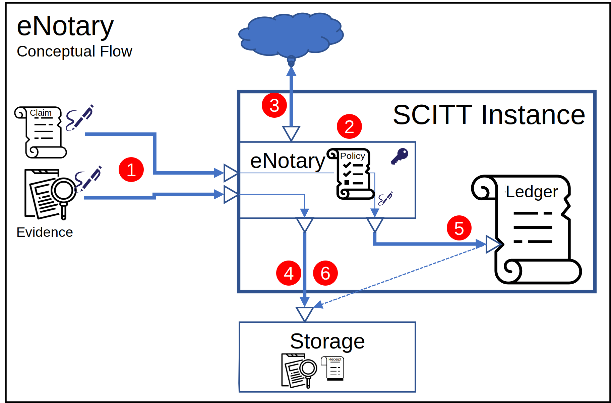

# SCITT eNotary

The ability to configure the types of supported identities, with specific identity allow/deny configurations.

SCITT provides a means to store information on a ledger. The information on the ledger is only as good as the validity of the identities making the entries.
Similar to a public notary, an eNotary verifies the identity of the incoming requests.
If the identity is verified, the eNotary will provide a notarized endorsement for the entry, issuing a receipt for the completed process.

Also similar to a public notary, the eNotary process does not attempt to validate the evidence being notarized.
It verifies the identities and makes a ledger entry of the claims, with pointers to any optional evidence.

## eNotary Conceptual Overview

The eNotary provides the following conceptual workflow:

1. A claim, (with optional evidence) is submitted to a SCITT instance
2. On ingress, the SCITT eNotary parses the identity associated with the claim and compares the identity type with those supported in the eNotary policy. 
3. If the eNotary policy supports the identity type, the eNotary will attempt to verify the validity of the identity.
4. If the identify is verified, the optional evidence is submitted to an associated storage account. The reference to the persisted evidence is maintained
5. A notarized entry is made to the SCITT registry (ledger), endorsed by the eNotaries key. The optional evidence reference is persisted in the registry as a pointer.
6. A receipt is returned, endorsed by the eNotary

## Claims Identity and SCITT Access Control

To submit information to a SCITT instance, access control would most likely be enforced.
Standard Roles Based Access Control (RBAC) would provide the means to read/write information.
The RBAC type would be determined by the host of the SCITT instance, and likely implements cloud specific identity and authorization capabilities.
Details of RBAC are covered elsewhere.

The identity associated with access control is often unrelated to the identity of the claims.
The claim identity may be a specific project, a build system, an auditor's report.
While the identity used for access control is captured in the ledger, and likely part of the receipt, the eNotary is validating the identity associated with the claim.
