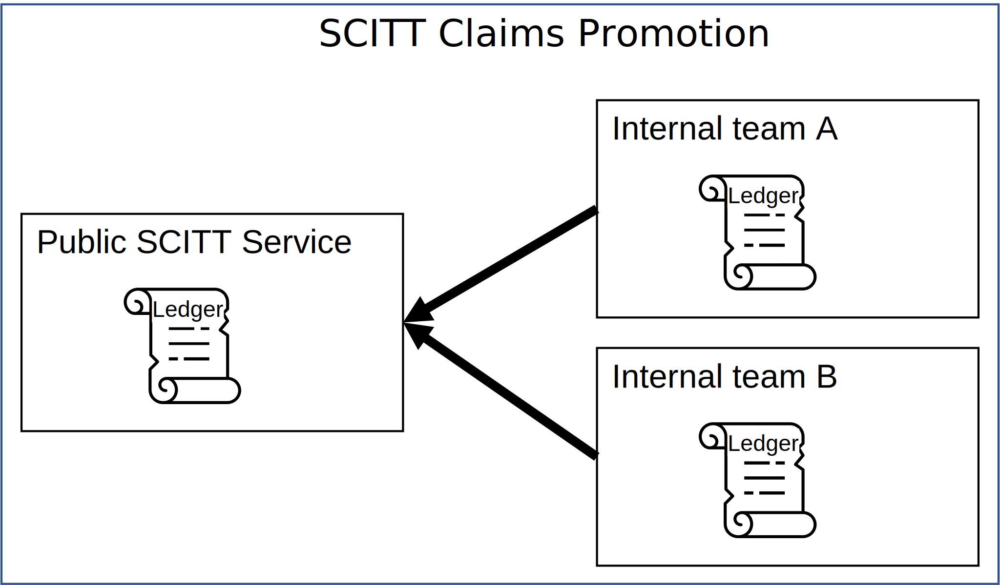

# SCITT Role Based Access Control

> TODO:
> - Why we need limited access to information submitted to SCITT 
> - Will SCITT support partitioned access within a SCITT instance, or will a SCITT instance be limited and only approved content is promoted to another SCITT instance that has broader access?

## Promotion Across RBAC Instances

Whether a SCITT instance supports RBAC partitioning or not, users will configure multiple SCITT instances to support their dev through production workflows, or their internal systems being maintained separate from their public services. Users can promote the content from internal, secured SCITT instances, to SCITT instances with different permissions, or public access.

## Design Options

### RBAC at the SCITT Instance

Any access to a SCITT instances means access to all content

#### Pros

Simpler to implement

#### Cons

- Teams that need to limit access within a SCITT instance will need to run multiple SCITT instances
- This may not work well when associating a SCITT instance with a registry/datastore that supports partitioned RBAC

### RBAC Partitioning a SCITT Instance

#### Pros

- Maps to existing registries/storage services that support partitioning

#### Cons

- Harder to implement
